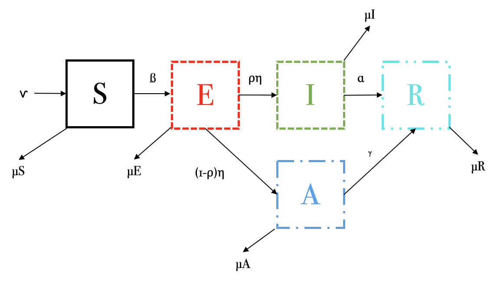

Las siguientes ecuaciones describen un modelo por compartimentos de una
enfermedad infecciosa con un estadio asintomático.
$$\dot S = \nu -\beta S(I +qA)-\mu S$$
$$\dot E= \beta S(I+qA) -(\eta+\mu)E $$
$$\dot I = p\eta E -(\alpha +\mu)I$$
$$\dot A= (1-p)\eta E -(\gamma +\mu)A$$
$$\dot R=\alpha I +\gamma A-\mu R$$

1.  **Dibuja el esquema por compartimentos que representa este conjunto
    de ecuaciones**



2.  **Explica el significado de cada ecuación: es decir, explica el
    significado de cada término y cada parámetro. ¿Existen parámetros
    que están acotados?, si es así, indica el intervalo en donde pueden
    variar.**

-   $\nu$: Tasa de nacimientos o individuos que entran al sistema.

-   $\beta$: Tasa de interacción entre susceptibles e infectados.

-   $q$:Tasa de interacción entre susceptibles y asintomáticos.

-   $\mu$: Tasa de muertes o individuos que salen del sistema.

-   $\eta$: Tasa en la que expuestos pasan al estado infeccioso o
    asintomático.

-   $p$: Proporción de la población.

-   $\alpha$: Tasa en la que los infectados se recuperan.

-   $\gamma$: Tasa en la que asintomáticos se recuperan.

Todas las tasas son acotadas, debido a que es $1/tiempo$. Además, la
población y la proporción de la población también es acotada y va de 0 a
1, como si fuera el 100%.

*Susceptibles:*

Favorece:

-   $\nu$: Individuos que nacen o entran alsistema.

Afecta:

-   $\beta SI$: Interacción entre susceptibles e infectados.

-   $\beta S q A$: Interacción entre susceptibles y asintomáticos.

-   $\mu S$: Individuos susceptibles que mueren o salen del sistema.

*Expuestos:*

Favorece:

-   $\beta SI$: Interacción entre susceptibles e infectados.

-   $\beta S q A$: Interacción entre susceptibles y asintomáticos.

Afecta:

-   $\eta E$: Individuos que pasan a ser infectados o asintomáticos.

-   $\mu E$ Individuos expuestos que mueren o salen del sistema.

*Infectados:*

Favorece:

-   $p \eta E$: Proporción de individuos expuestos que pasan a
    infectados.

Afecta:

-   $\alpha I$: Individuos infectados que se recuperan.

-   $\mu I$: Individuos infectados que mueren o salen del sistema.

*Asintomáticos:*

Favorece:

-   $(1-p) \eta E$: Proporción de individuos expuestos que no son
    infectados, sino asintomáticos.

Afecta:

-   $\gamma A$: Individuos asintomáticos que se recuperan.

-   $\mu A$: Individuos asintomáticos que mueren o salen del sistema.

*Recuperados:*

Favorece:

-   $\alpha I$: Individuos infectados que serecuperan.

-   $\gamma A$: Individuos asintomáticos que se recuperan.

Afecta:

-   $\mu R$: Individuos recuperados que mueren o salen del sistema.

3.  **¿Bajo qué condiciones la población se conservaría?**

La población se conservaría si la suma de las tasas de muerte es igual a
la tasa de nacimientos.
$$ \nu = (\mu S + \mu E + \mu I + \mu A + \mu R)$$

4.  **Encuentra, si existe, el punto de equilibrio *free-disease***

Debido a que el modelo *free-disease* hace referencia a que no hay
individuos infectados, con esa misma premisa, no puede haber individuos
expuestos, ni asintomáticos, ni recuperados, únicamente susceptibles. Si
se igualan esas condiciones a 0, queda:

$$\dot S = \nu - \beta S (0 +q0) - \mu S = \nu - \mu S = S = \nu / \mu $$
$$\dot E = \beta S (0 + q0) - (\eta + \mu)0 = 0 $$
$$\dot I = p \eta 0 - (\alpha + \mu)0 = 0$$
$$\dot A = (1 - p) \eta 0 - (\gamma + \mu)0 = 0$$
$$\dot R = \alpha 0 + \gamma 0-\mu 0 = 0$$

Por lo tanto, el punto de equilibrio *free-disease* sería:
$(S, E, I, A, R) = (\nu / \mu, 0, 0, 0, 0)$

5.  **¿Qué tipo de enfermedad puede estar describiendo? Justifica tu
    respuesta.**

COVID por infección de SARS-Cov-2, porque justo se tienen dos estadios
posteriores a la exposición: infeccioso o asintomático (no se puede ser
ambos, es uno u otro); además de tener un estadio de recuperación. A lo
mejor, para hacerlo más certero, agregaría la conexión entre recuperados
y susceptibles, además de la entrada directa a recuperados, por las
vacunas.

6.  **Selecciona un conjunto de parámetros adecuados y resuelve
    numéricamente el sistema de ecuaciones diferenciales. Asegúrate que
    tu solución alcance un punto de equilibrio. Discute tu resultado.**

```{r}
library (deSolve) 

SEIAR <- function (time, state, parameters) {
  with (as.list (c (state, parameters)), {
    dS <- nu - beta * S * I - beta * S * q * A - muS
    dE <- beta * S * I - beta * S * q * A - eta * E - muE
    dI <- p * eta * E - alpha * I - muI
    dA <- (1 - p) * eta * E - gamma * A - muA
    dR <- alpha * I + gamma * A - muR
    list (c (dS, dE, dI, dA, dR)) 
  })
}

parameters <- c (nu = 1, beta = 0.3, q = 0.2, eta = 0.4, p = 0.8, gamma = 0.2, alpha = 0.1, muS = 0.1, muE = 0.2, muI = 0.5, muA = 0.4, muR = 0.1)
initial_conditions <- c (S = 100, E = 50, I = 20, A = 20, R = 30) 
time <- seq (0, 100, by = 0.001)
out <- ode (initial_conditions, time, SEIAR, parameters)

matplot (out [ , 1], out [ , 2 : 6], type = "l", xlab = "TIEMPO", ylab = "POBLACIÓN", main = "MODELO SEIAR, ESTADIO ASINTOMÁTICO (0 - 100)", lwd = 3)
legend ("topright", c ("SUSCEPTIBLE", "EXPUESTO", "INFECTADO", "ASINTOMÁTICO", "RECUPERADO"), col = 1 : 5, lty = 1 : 5, cex = 0.5)

parameters <- c (nu = 1, beta = 0.3, q = 0.2, eta = 0.4, p = 0.8, gamma = 0.2, alpha = 0.1, muS = 0.1, muE = 0.2, muI = 0.5, muA = 0.4, muR = 0.1)
initial_conditions <- c (S = 100, E = 50, I = 20, A = 20, R = 30) 
time <- seq (0, 40, by = 0.001)
out <- ode (initial_conditions, time, SEIAR, parameters)

matplot (out [ , 1], out [ , 2 : 6], type = "l", xlab = "TIEMPO", ylab = "POBLACIÓN", main = "MODELO SEIAR, ESTADIO ASINTOMÁTICO (0 - 40)", lwd = 3)
legend ("topright", c ("SUSCEPTIBLE", "EXPUESTO", "INFECTADO", "ASINTOMÁTICO", "RECUPERADO"), col = 1 : 5, lty = 1 : 5, cex = 0.5)

parameters <- c (nu = 1, beta = 0.3, q = 0.2, eta = 0.4, p = 0.8, gamma = 0.2, alpha = 0.1, muS = 0.1, muE = 0.2, muI = 0.5, muA = 0.4, muR = 0.1)
initial_conditions <- c (S = 100, E = 50, I = 20, A = 20, R = 30) 
time <- seq (0, 1750, by = 0.001)
out <- ode (initial_conditions, time, SEIAR, parameters)

matplot (out [ , 1], out [ , 2 : 6], type = "l", xlab = "TIEMPO", ylab = "POBLACIÓN", main = "MODELO SEIAR, ESTADIO ASINTOMÁTICO (0 - 1750)", lwd = 3)
legend ("topright", c ("SUSCEPTIBLE", "EXPUESTO", "INFECTADO", "ASINTOMÁTICO", "RECUPERADO"), col = 1 : 5, lty = 1 : 5, cex = 0.5)

```

El punto de equilibrio sería +/- al tiempo 40, que es cuando las líneas
se vuelven asintóticas. Podemos observar que, por los valores de los
parámetros, casi toda la población llega a recuperados; así como el
hecho de que los infectados serán mayores a los asintomáticos.

Sin embargo, como la población no se conserva, +/- al tiempo 1750, los
individuos recuperados llegan a 0, junto con susceptibles, infectados,
asintomáticos y recuperados, debido a que suma de las tasas de muerte
son mayores a la de nacimiento.
