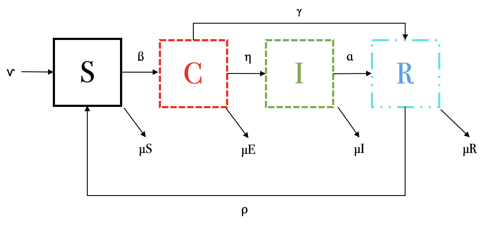

Las siguientes ecuaciones describen un modelo por compartimentos de una
enfermedad infecciosa con un estadio crónico.
$$\dot S = \nu - \beta S(I + qC) - \mu S + \rho R$$
$$\dot C = \beta S(I + qC) - (\eta +\gamma +\mu)C $$
$$\dot I = \eta C - (\alpha +\mu)I$$
$$\dot R = \alpha I + \gamma C - (\mu + \rho)R$$

1.  **Dibuja el esquema por compartimentos que representa este conjunto
    de ecuaciones.**



2.  **Explica el significado de cada ecuación: es decir, explica el
    significado de cada término y cada parámetro. ¿Existen parámetros
    que están acotados?, si es así, indica el intervalo en donde pueden
    variar.**

-   $\nu$: Tasa de nacimientos o individuos que entran al sistema.

-   $\beta$: Tasa de interacción entre susceptibles e infectados.

-   $q$: Tasa de interacción entre susceptibles y crónicos.

-   $\rho$: Tasa en la que individuos que vuelven a ser susceptibles,
    después de recuperarse.

-   $\mu$: Tasa de muertes o individuos que salen del sistema.

-   $\eta$: Tasa en la que los individuos pasan de ser crónicos a sólo
    infectados.

-   $\gamma$: Tasa en la que los crónicos se recuperan.

-   $\alpha$: Tasa en la que los infectados se recuperan.

Todas las tasas son acotadas, debido a que es $1/tiempo$.

*Susceptibles:*

Favorece:

-   $\nu$: Individuos que nacen o entran al sistema.

-   $\rho R$ Individuos que vuelven a ser susceptibles después de
    recuperarse.

Afecta:

-   $\beta SI$: Interacción entre susceptibles e infectados.

-   $\beta S q C$: Interacción entre susceptibles y crónicos.

-   $\mu S$: Individuos susceptibles que mueren o salen del sistema.

*Crónicos:*

Favorece:

-   $\beta SI$: Interacción entre susceptibles e infectados.

-   $\beta S q C$: Interacción entre susceptibles y crónicos.

Afecta:

-   $\eta C$: Individuos que pasan a ser infectados o crónicos.

-   $\gamma C$: Individuos crónicos que se recuperan.

-   $\mu C$ Individuos expuestos que mueren o salen del sistema.

*Infectados:*

Favorece:

-   $p \eta C$: Individuos crónicos que pasan a infectados.

Afecta:

-   $\alpha I$: Individuos infectados que se recuperan.

-   $\mu I$: Individuos infectados que mueren o salen del sistema.

*Recuperados:*

Favorece:

-   $\alpha I$: Individuos infectados que se recuperan.

-   $\gamma A$: Individuos crónicos que se recuperan.

Afecta:

-   $\rho R$: Individuos que vuelven a ser susceptibles, después de
    recuperarse.

-   $\mu R$: Individuos recuperados que mueren o salen del sistema.

3.  **¿Bajo qué condiciones la población se conservaría?**

La población se conservaría si la suma de las tasas de muerte es igual a
la tasa de nacimientos. $$ \nu = (\mu S + \mu C + \mu I + \mu R)$$

4.  **Encuentra, si existe, el punto de equilibrio *free-disease***

Debido a que el modelo *free-disease* hace referencia a que no hay
individuos infectados, con esa misma premisa, no puede haber individuos
crónicos, ni recuperados, únicamente susceptibles. Si se igualan esas
condiciones a 0, queda:

$$\dot S = \nu - \beta S (0 +q0) - \mu S + \rho 0 = \nu - \mu S = S = \nu / \mu $$
$$\dot C = \beta S (0 + q0) - (\eta + \gamma + \mu)0 = 0 $$
$$\dot I = \eta 0 - (\alpha + \mu)0 = 0$$
$$\dot R = \alpha 0 + \gamma 0 - (\mu + \rho) 0 = 0$$

Por lo tanto, el punto de equilibrio *free-disease* sería:
$(S, C, I, R) = (\nu / \mu, 0, 0, 0)$

5.  **¿Qué tipo de enfermedad puede estar describiendo? Justifica tu
    respuesta.**

Podría ser la tuberculosis, por el estadio crónico infeccioso, en donde
la bacteria queda en estado latente. Además, se tiene el paso de crónico
a infectado; sin embargo, yo añadiría el paso de susceptible a
infectado, para este ejemplo.

6.  **Selecciona un conjunto de parámetros adecuados y resuelve
    numéricamente el sistema de ecuaciones diferenciales. Asegúrate que
    tu solución alcance un punto de equilibrio.Discute tu resultado.**

```{r}
library (deSolve) 

SCIR <- function (time, state, parameters) {
  with (as.list (c (state, parameters)), {
    dS <- nu - beta * S * I - beta * S * q * C + rho * R - muS
    dC <- beta * S * I - beta * S * q * C - eta * C + gamma * C - muC
    dI <- eta * C - alpha * I - muI
    dR <- alpha * I + gamma * C - rho * R - muR
    list (c (dS, dC, dI, dR)) 
  })
}

parameters <- c (nu = 1, beta = 0.3, rho = 0.5, q = 0.4, eta = 0.5, gamma = 0.2, alpha = 0.5, muS = 0.2, muC = 0.4, muI = 0.5, muR = 0.1)
initial_conditions <- c (S = 200, C = 50, I = 70, R = 30) 
time <- seq (0, 100, by = 0.001)
out <- ode (initial_conditions, time, SCIR, parameters)

matplot (out [ , 1], out [ , 2 : 5], type = "l", xlab = "TIEMPO", ylab = "POBLACIÓN", main = "MODELO SCIR, ESTADIO CRÓNICO (0 - 100)", lwd = 3)
legend ("topright", c ("SUSCEPTIBLE", "CRÓNICO", "INFECTADO", "RECUPERADO"), col = 1 : 4, lty = 1 : 5, cex = 0.5)

parameters <- c (nu = 1, beta = 0.3, rho = 0.5, q = 0.4, eta = 0.5, gamma = 0.2, alpha = 0.5, muS = 0.2, muC = 0.4, muI = 0.5, muR = 0.1)
initial_conditions <- c (S = 200, C = 50, I = 70, R = 30) 
time <- seq (0, 10, by = 0.001)
out <- ode (initial_conditions, time, SCIR, parameters)

matplot (out [ , 1], out [ , 2 : 5], type = "l", xlab = "TIEMPO", ylab = "POBLACIÓN", main = "MODELO SCIR, ESTADIO CRÓNICO (0 - 10)", lwd = 3)
legend ("topright", c ("SUSCEPTIBLE", "CRÓNICO", "INFECTADO", "RECUPERADO"), col = 1 : 4, lty = 1 : 5, cex = 0.5)

```

Debido a los parámetros en el modelo, se llega al punto de equilibrio
muy rápido, pues el valor de $\rho$ es muy alto, es de 0.5, entonces los
individuos se recuperan muy pronto y el sistema se vuelve cíclico. Los
infectados tienen un pico al inicio, pero se mantienen relativamente
estables, justo por esa ciclicidad. El punto de equilibrio es +/- 5.
Además, en la primera figura podemos ver que, pasado el tiempo
suficiente, las poblaciones llegarán a 0, pues la tasa de nacimientos es
menor a la suma de las tasas de muerte.
