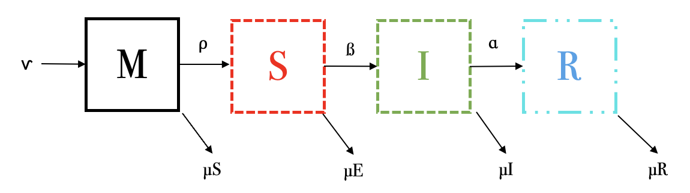

La inmunidad pasiva consiste en la transferencia de inmunidad activa en
la forma de anticuerpos de un individuo a otro. La inmunidad pasiva
puede suceder de forma natural, por ejemplo, por la vía materna al feto
a través de la placenta o al bebé vía la leche materna. El estadio de
inmunidad pasiva se denota por la variable $M(t)$ y se añade al sistema
antes de que los individuos sean suceptibles. El siguiente modelo
**MSIR** se describe con las siguientes ecuaciones diferenciales.

$$\dot M = \nu - \rho M - \mu M$$
$$\dot S = \rho M - \beta S I - \mu S $$
$$\dot I = \beta S I - (\alpha + \mu) I$$ $$\dot R = \alpha I - \mu R$$

1.  **¿Bajo qué condiciones se puede inducir de forma artificial la
    inmunidad pasiva?**

A través de vacunas que confieran inmunidad por poco tiempo, en lo que
el sistema inmune del individuo madura lo suficiente como para tener una
respuesta propia; por ejemplo, las vacunas anti-toxinas para el veneno
de algún animal.

2.  **Dibuja el esquema por compartimentos que representa este conjunto
    de ecuaciones**



3.  **Explica el significado de cada ecuación: es decir, explica el
    significado de cada término y cada parámetro. ¿Existen parámetros
    que están acotados?, si es así, indica el intervalo en donde pueden
    variar.**

-   $\nu$: Tasa de nacimientos o individuos que entran al sistema.

-   $\rho$: Tasa en la que los individuos pierden la inmunidad pasiva y
    entran a los susceptibles.

-   $\beta$: Tasa de interacción entre susceptibles e infectados.

-   $\mu$: Tasa de muertes o individuos que salen del sistema.

-   $\alpha$: Tasa en la que los infectados se recuperan.

Todas las tasas son acotadas, debido a que es $1/tiempo$.

*Inmunidad pasiva*

Favorece:

-   $\nu$: Individuos que nacen o entran al sistema.

Afecta:

-   $\rho M$: Individuos que pierden la inmunidad pasiva.

-   $\mu M$: Individuos con inmunidad pasiva que mueren o salen del
    sistema.

*Susceptibles*:

Favorece:

-   $\rho M$: Individuos que pierden la inmunidad pasiva.

Afecta:

-   $\beta SI$: Interacción entre susceptibles e infectados.

-   $\mu S$: Individuos susceptibles que mueren o salen del sistema.

*Infectados:*

Favorece:

-   $\beta SI$: Interacción entre susceptibles e infectados.

Afecta:

-   $\alpha I$: Individuos infectados que se recuperan.

-   $\mu I$: Individuos infectados que mueren o salen del sistema.

*Recuperados:*

Favorece:

-   $\alpha I$: Individuos infectados que se recuperan.

Afecta:

-   $\mu R$: Individuos recuperados que mueren o salen del sistema.

4.  **¿Bajo qué condiciones la población se conservaría?**

La población se conservaría si la suma de las tasas de muerte es igual a
la tasa de nacimientos.

$$ \nu = (\mu M + \mu S + \mu I + \mu R)$$

5.  **Encuentra, si existe, el punto de equilibrio *free-disease***\

Debido a que el modelo *free-disease* hace referencia a que no hay
individuos infectados, con esa misma premisa, no puede haber individuos
recuperados, únicamente susceptibles y con inmunidad pasiva. Si se
igualan esas condiciones a 0, queda:

$$\dot M = \nu - \rho M - \mu M = \nu - \mu M = \nu/\mu = M$$
$$\dot S = \rho (\nu/\mu) - \beta S 0 - \mu S = \rho (\nu/\mu) - \mu S = \rho (\nu/\mu) / \mu  $$
$$\dot I = \beta S 0 - (\alpha + \mu) 0 = 0 $$
$$\dot R = \alpha 0 - \mu 0 = 0$$

Por lo tanto, el punto de equilibrio *free-disease* sería:
$(M, S, I, R) = (\nu / \mu, \rho (\nu/\mu) / \mu, 0, 0)$

6.  **¿Qué tipo de enfermedad puede estar describiendo? Justifica tu
    respuesta.**

Hepatitis A y/o B, en donde se pueden recibir anticuerpos a través de la
madre, pero también a través de vacunas (que se ponen de recién nacidx).
Otro ejemplo, como mencioné anteriormente, pero que no es una enfermedad
como tal, son las vacunas preventivas para mordidas de serpiente.

7.  **Selecciona un conjunto de parámetros adecuados y resuelve
    numéricamente el sistema de ecuaciones diferenciales. Asegúrate que
    tu solución alcance un punto de equilibrio.Discute tu resultado.**

```{r}
library (deSolve) 

MSIR <- function (time, state, parameters) {
  with (as.list (c (state, parameters)), {
    dM <- nu - rho * M - muM
    dS <- rho * M - beta * S * I - muS
    dI <-  beta * S * I - alpha * I - muI
    dR <- alpha * I - muR
    list (c (dM, dS, dI, dR)) 
  })
}

parameters <- c (nu = 1, rho = 0.4, beta = 0.5, alpha = 0.3, muM = 0.2, muS = 0.4, muI = 0.5, muR = 0.1)
initial_conditions <- c (M = 500, S = 50, I = 70, R = 30) 
time <- seq (0, 100, by = 0.001)
out <- ode (initial_conditions, time, MSIR, parameters)

matplot (out [ , 1], out [ , 2 : 5], type = "l", xlab = "TIEMPO", ylab = "POBLACIÓN", main = "MODELO MSIR, ESTADIO DE INMUNIDAD PASIVA (0 - 100)", lwd = 3)
legend ("topright", c ("INMUNIDAD", "SUSCEPTIBLE", "INFECTADO", "RECUPERADO"), col = 1 : 4, lty = 1 : 5, cex = 0.5)

parameters <- c (nu = 1, rho = 0.4, beta = 0.5, alpha = 0.3, muM = 0.2, muS = 0.4, muI = 0.5, muR = 0.1)
initial_conditions <- c (M = 500, S = 50, I = 70, R = 30) 
time <- seq (0, 15, by = 0.001)
out <- ode (initial_conditions, time, MSIR, parameters)

matplot (out [ , 1], out [ , 2 : 5], type = "l", xlab = "TIEMPO", ylab = "POBLACIÓN", main = "MODELO MSIR, ESTADIO DE INMUNIDAD PASIVA (0 - 15)", lwd = 3)
legend ("topright", c ("INMUNIDAD", "SUSCEPTIBLE", "INFECTADO", "RECUPERADO"), col = 1 : 4, lty = 1 : 5, cex = 0.5)

```

Debido a los parámetros en el modelo, se puede observar que +/-al tiempo
25, las poblaciones llegan a 0, pues la tasa de nacimientos es menor a
la suma de las tasas de muerte. Adicional a eso, +/- al tiempo 15 se
llega al punto de equilibrio, en donde las poblaciones no cambian y se
mantienen asintóticas. Como es de esperarse, al final, los individuos
llegarán al estado de recuperados y los pocos que se mantienen
susceptibles e infectados, son los que entran al sistema con inmunidad
pasiva.
