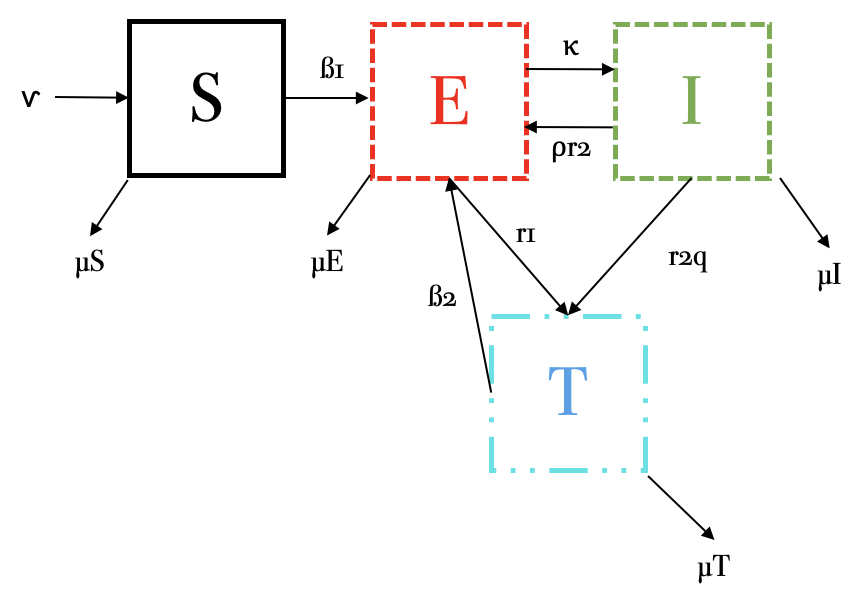

Considera el siguiente conjunto de ecuaciones diferenciales que
describen una enfermedad infecciosa con individuos en tratamiento
$T(t)$.

$$\dot S = \nu - \beta_1 \frac {SI} {N} - \mu S$$
$$\dot E = \beta_1\frac{SI}{N} + \beta_2 \frac{TI}{N}-(\mu +\kappa +r_1)E +pr_2I $$
$$\dot I = \kappa E-(r_2+\mu)I $$
$$\dot T = r_1E +qr_2I -\beta_2\frac{TI}{N}-\mu T$$

con $N(t)=S(t)+E(t)+I(t)+T(t)$

1.  **Dibuja el esquema por compartimentos que representa este conjunto
    de ecuaciones.**

{width="663"}

2.  **Explica el significado de cada ecuación: es decir, explica el
    significado de cada término y cada parámetro. ¿Existen parámetros
    que están acotados?, si es así indica el intervalo en donde pueden
    variar.**

-   $\nu$: Tasa de nacimientos o individuos que entran al sistema.

-   $\beta_1$: Tasa de interacción entre susceptibles e infectados.

-   $\beta_2$: Tasa de interacción entre susceptibles e individuos en
    tratamiento.

-   $\kappa$: Tasa en la que los expuestos pasan a ser infectados.

-   $r_1$: Individuos expuestos que pasan a tratamiento.

-   $p$: Proporción de la población que pasa de infectados a expuestos.

-   $r_2$: Individuos infectados que pasan a tratamiento.

-   $q$: Proporción de la población que pasa de infectados a
    tratamientos.

-   $\mu$: Tasa de muertes o individuos que salen del sistema.

Todas las tasas son acotadas, debido a que es $1/tiempo$. Además, la
población y la proporción de la población también es acotada y va de 0 a
1, como si fuera el 100%.

*Susceptibles:*

Favorece:

-   $\nu$: Individuos que nacen o entran al sistema.

Afecta:

-   $\beta_1 \frac{SI}{N}$: Interacción entre susceptibles e infectados.

-   $\mu S$: Individuos susceptibles que mueren o salen del sistema.

*Expuestos:*

Favorece:

-   $\beta_1 \frac{SI}{N}$: Interacción entre susceptibles e infectados.

-   $\beta_2 \frac{SI}{N}$: Interacción entre tratamiento e infectados.

-   $pr_2 I$: Proporción de individuos infectados que pasa a expuestos.

Afecta:

-   $\mu E$: Individuos expuestos que mueren o salen del sistema.

-   $\kappa E$: Individuos expuestos que pasan a infectados.

-   $r_1 E$: Individuos expuestos que pasan a tratamiento.

*Infectados:*

Favorece:

-   $\kappa E$: Individuos expuestos que pasan a infectados.

Afecta:

-   $r_2 I$: Individuos infectados que pasan a tratamiento.

-   $\mu I$: Individuos infectados que mueren o salen del sistema.

*Tratamiento:*

Favorece:

-   $r_1 E$: Individuos expuestos que pasan a tratamiento.

-   $qr_2 I$: Proporción de individuos infectados que pasan a
    tratamiento.

Afecta:

-   $\beta_2 \frac{SI}{N}$: Interacción entre tratamiento e infectados.

-   $\mu T$: Individuos en tratamiento que mueren o salen del sistema.

3.  **¿Bajo qué condiciones la población se conservaría?**

La población se conservaría si la suma de las tasas de muerte es igual a
la tasa de nacimientos.

$$ \nu = (\mu S + \mu E + \mu I + \mu T)$$

4.  **Encuentra, si existe, el punto de equilibrio *free-disease***

Debido a que el modelo *free-disease* hace referencia a que no hay
individuos infectados, con esa misma premisa, no puede haber individuos
expuestos, únicamente susceptibles y en tratamiento. Si se igualan esas
condiciones a 0, queda:

$$\dot S = \nu - \beta_1 \frac {S0} {N} - \mu S = S = \nu/\mu$$
$$\dot E = \beta_1\frac{S0}{N} + \beta_2 \frac{T0}{N}-(\mu +\kappa +r_1)0 +pr_20 = 0 $$
$$\dot I = \kappa 0-(r_2+\mu)0 = 0 $$
$$\dot T = r_10 +qr_20 -\beta_2\frac{T0}{N}-\mu T = T = \mu$$

Por lo tanto, el punto de equilibrio *free-disease* sería:
$(S, E, I, T) = (\nu / \mu, 0, 0, \mu)$

5.  **¿Qué tipo de enfermedad puede estar describiendo? Justifica tu
    respuesta.**

VIH, pues se tienen estadios infectivos, expuestos y en tratamiento.
Además, sin importar el tipo de tratamiento, siempre habrá posibilidad
de que un individuo en tratamiento infecte a otro y entre al estado
expuesto. Finalmente, los individuos pueden estar pasando entre
expuestos, infectados y en tratamiento.

6.  **Selecciona un conjunto de parámetros adecuados y resuelve
    numéricamente el sistema de ecuaciones diferenciales. Asegúrate que
    tu solución alcance un punto de equilibrio.Discute tu resultado.**

```{r}
library (deSolve) 

SEIT <- function (time, state, parameters) {
  with (as.list (c (state, parameters)), {
    dS <- nu - beta1 * (S * I / N) - muS
    dE <- beta1 * (S * I / N) + beta2 * (Tr * I / N) - kappa * E - r1 * E + p * r2 * I - muE
    dI <- kappa * E - r2 * I - muI
    dT <- r1 * E + q * r2 * I - beta2 * (Tr * I / N) - muT
    list (c (dS, dE, dI, dT)) 
  })
}

parameters <- c (nu = 1, beta1 = 0.8, beta2 = 0.4, kappa = 0.3, r1 = 0.2, p = 0.2, r2 = 0.3, q = 0.1, muS = 0.2, muE = 0.4, muI = 0.4, muT = 0.1, N = 650)
initial_conditions <- c (S = 500, E = 50, I = 70, Tr = 30) 
time <- seq (0, 150, by = 0.001)
out <- ode (initial_conditions, time, SEIT, parameters)

matplot (out [ , 1], out [ , 2 : 5], type = "l", xlab = "TIEMPO", ylab = "POBLACIÓN", main = "MODELO MSIR, ESTADIO DE TRATAMIENTO (0 - 150)", lwd = 3)
legend ("topright", c ("SUSCEPTIBLE", "EXPUESTO", "INFECTADO", "TRATAMIENTO"), col = 1 : 4, lty = 1 : 5, cex = 0.5)

parameters <- c (nu = 1, beta1 = 0.8, beta2 = 0.4, kappa = 0.3, r1 = 0.2, p = 0.2, r2 = 0.3, q = 0.1, muS = 0.2, muE = 0.4, muI = 0.4, muT = 0.1, N = 650)
initial_conditions <- c (S = 500, E = 50, I = 70, Tr = 30) 
time <- seq (0, 50, by = 0.001)
out <- ode (initial_conditions, time, SEIT, parameters)

matplot (out [ , 1], out [ , 2 : 5], type = "l", xlab = "TIEMPO", ylab = "POBLACIÓN", main = "MODELO MSIR, ESTADIO DE TRATAMIENTO (0 - 50)", lwd = 3)
legend ("topright", c ("SUSCEPTIBLE", "EXPUESTO", "INFECTADO", "TRATAMIENTO"), col = 1 : 4, lty = 1 : 5, cex = 0.5)

```

Debido a los parámetros del modelo, al tiempo +/- 140, las poblaciones
de expuestos, infectados y en tratamiento comienzan a ir a 0, debido a
la tasa de muerte; sin embargo, la población de susceptibles comienza a
aumentar al tiempo +/- 100, debido también a los mismos parámetros. El
punto de equilibrio es al tiempo +/- 50 y por los parámetros, habrán más
individuos en tratamiento, que expuestos e infectados, que, además,
tendrán valores similares.
